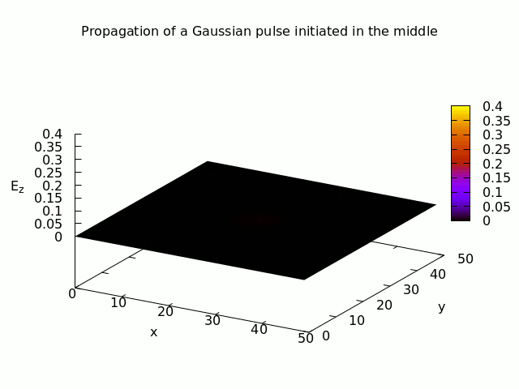
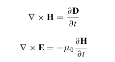
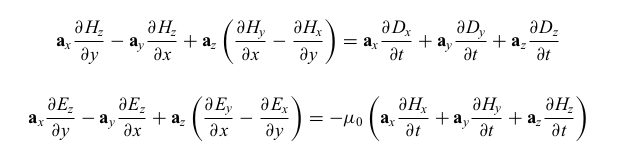
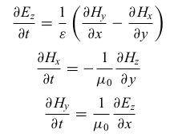
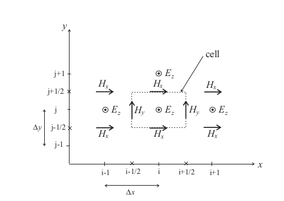
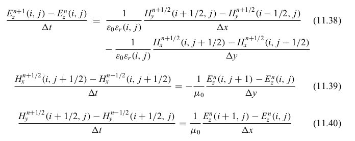

# Maxwell FDTD
## Solving Maxwells Equations using Finite Domain Time Difference
We demonstrate how to use Finite Domain Time Difference to solve the Maxwell's (Partial Differential) Equation. The GIF shows the solution of how a Gaussian wave originating at the center of a surface propagates over time on the surface.

We start with the general form of the Maxwell's equations, in particular the Curl versions:

The ``Nabla cross`` represents a Curl. This can be decomposed into more familiar 'differentials' as:

Each vector component can be 'grouped', the result being that two groups are formed representing a Transverse Electric componentto z-polarization, TE_z. Similarly, another group of Transverse Magnetic component to z-polarization, TM_z. We show the TM_z group:

Now the 'differential' equations can be represented in discreet form using the Central Limit Theorem. To 'discretize' the space, we use a Yee lattice,in which E and H components are interleaved in the space lattice at intervals of Delta x/2 in space and Delta t/2 in time, forming a staggered grid. 

The result is a set of discreet differential equations:

We then use C++ programming to solve these equations using Standard Vector templates, looping constructs, and GNUPlot to visualize the solution

The ``plot`` script then plots the data after each iteration as a png image (2D). These images are then animated using GIMP to produce the GIF showing the progression of the Gaussian pulse that initially appears at the centre of the surface.

#### References
1. Wartak, M. S., "Computational Photonics", Cambridge University Press. (2013).
2. Joannopoulos, J. D. et al., "Photonic Crystals", Princeton University Press. (2008).
3. http://www.gnuplot.info/documentation.html 

